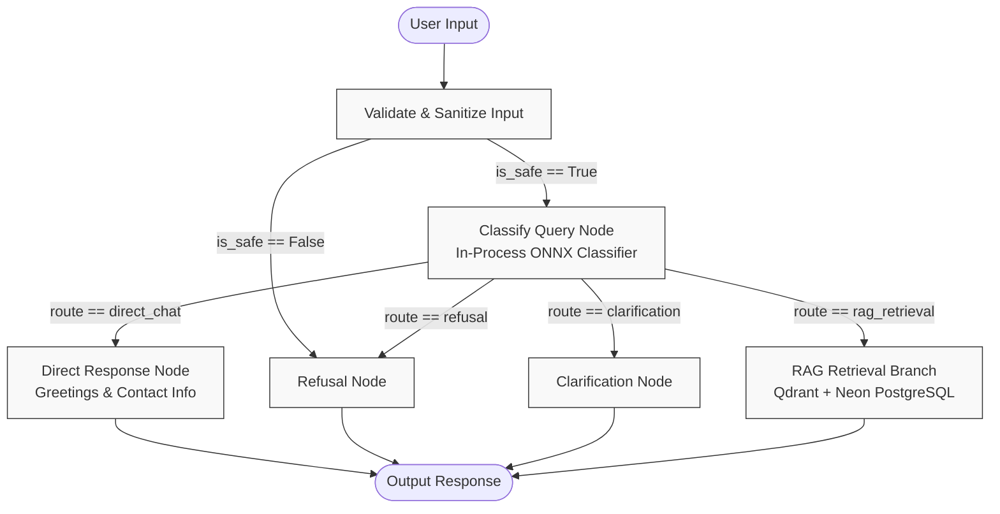

# Assistant Graph Architecture & Topology

## Overview

The "Talk to Mahad" assistant uses **LangGraph** to coordinate a directed, typed state machine orchestrating query classification, safety checking, deterministic shortcut responses, and grounded RAG retrieval.

Hosting is pinned to the permanent Hugging Face CPU Basic tier ($0.00/mo operating budget). Heavy LLM queries are preserved only for grounded contextual synthesis, while deterministic routes and query classification execute completely in-process.

---

## State Schema (`AssistantState`)

The state machine uses a typed dictionary `AssistantState` with the following attributes:

| Field | Type | Description |
| :--- | :--- | :--- |
| `input_text` | `str` | Raw input from user |
| `session_id` | `str` | UUID for conversation correlation |
| `mode` | `str` | Interaction mode (`text` or `voice`) |
| `transcript` | `list[dict]` | Prior conversation turns |
| `sanitized_query` | `str` | Cleaned and validated query text |
| `is_safe` | `bool` | Safety and prompt-injection check flag |
| `safety_violations`| `list[str]` | Detected security or boundary violations |
| `classifier_output`| `dict` | Output from in-process ONNX model |
| `route` | `str` | Recommended execution branch |
| `intent` | `str` | Classified user intent |
| `language` | `str` | Detected language (`en` or `ur`) |
| `confidence` | `float` | Routing prediction confidence score |
| `retrieval_query` | `str` | Vector retrieval query string |
| `evidence_chunks` | `list[dict]` | Canonical retrieved chunks |
| `retrieval_retries`| `int` | Rewrite iteration counter (max 1 rewrite) |
| `draft_answer` | `str` | Unrefined synthesized answer draft |
| `final_answer` | `str` | Final markdown response with strict citations |
| `citations` | `list[str]` | Chunk IDs cited in the answer |
| `execution_steps` | `list[dict]` | Step latencies and telemetry for the UI Inspector |
| `errors` | `list[str]` | Non-fatal execution errors |

---

## Graph Topology

---

## Bounded Execution & Safety Invariants

1. **Deterministic Safety Gating**: Prompt injection patterns, jailbreak keywords, and out-of-bounds characters are filtered prior to model classification. Unsafe inputs branch directly to `refusal_node` without invoking model evaluation or retrieval.
2. **Zero-LLM Fast Paths**: Greetings (`intent=greeting`) and contact queries (`intent=contact_info`) resolve in `< 1ms` via `direct_response_node` with zero token burn or API overhead.
3. **Hard Recursion Limit**: The compiled LangGraph instance enforces `recursion_limit = 10`, mathematically eliminating infinite retry or re-route loops.
4. **Single Query Rewrite**: Query rewrite retry count (`retrieval_retries`) is capped at `1` in Version 1.
5. **Inspectable Telemetry**: Each executed node records its name, duration in milliseconds, and status into `execution_steps`, which is returned to the frontend Execution Inspector.
